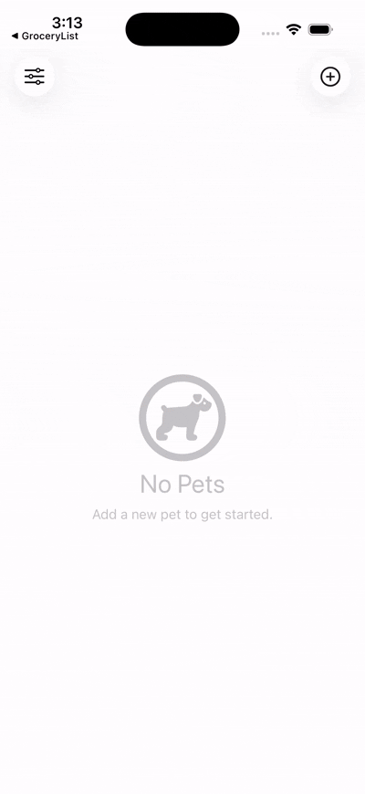

# Paws App

The Paws App is a swiftUI app that allows users to create, edit, and store information about their pets, including photos and names, all while providing an intuitive user interface. Users can easily add new pet items, edit existing ones, and view them in a grid layout, making the app both fun and functional.

**APP PREVIEW :**

  

## 🛠 Technical Stack & Architecture

• Xcode version : 26.4

• Language : Swift 6

• Framework: SwiftData and Photo Picker

 
## 🚀 Features

• Photo Storage: Users can save photos of their pets, integrating with SwiftData to ensure the images are stored properly

• Photo Picker: Incorporates SwiftUI's native photo picker for users to easily select and upload pet images

• Data Display: Fetches pet data from a database and displays it using a grid layout, providing a visually appealing way to browse pets

• Navigation Links: Users can navigate between different views in the app, making it easy to access various functionalities

• Editing and Deleting: A unique editing view allows users to modify pet details, and there’s functionality to delete pet items when no longer needed

## 💡 What I Learned

• Designing using SwiftUI

• Data Persistence using SwiftData

• Implementation of Photo Picker

• Navigation within an app using SwiftUI’s capabilities

